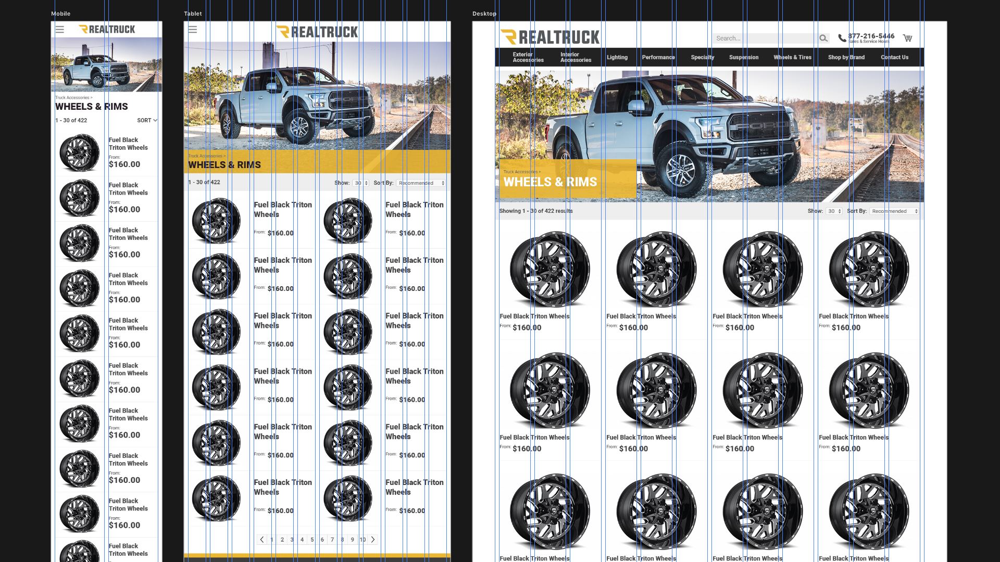

# Front-End Dev Test

Hello & thank you for your interest in joining our team. We've setup a few little exercises to help assess your skillset.

## Getting Setup

To get started you'll need a few things setup if you haven't already:

- Photoshop (or any other design app that can read PSD files) installed
- A GitHub or GitLab account
- GIT installed
- Node v7 or higher installed

**Please Note** \
Don't feel defeated. While these tests may seem simple at first blush, there are some things about them that are bloody difficult to pull off. Do the best you can *now* and we'll grow from there.

[HTML/CSS Skills Test](#htmlcss-skills-test)
- [Instructions](#instructions)
- [What we're looking for](#what-were-looking-for)
- [Helpful Hints](#helpful-hints)

[JavaScript Skills Test](#javascript-skills-test)
- [Instructions](#instructions-1)
- [JS Test 1](#js-test-1)
- [JS Test 2](#js-test-2)
- [Setup --help](#setup---help)

## HTML/CSS Skills Test

### Instructions
To test your HTML/CSS skills, we've created a mock-up for a products-listing page under the `./assets` folder. You'll find the image files needed included there. Create a completed HTML page along with the CSS required for styling saved in the `./product-listing` directory.



### What we're looking for
- Semantically-correct HTML
- CSS Structure (...if using a pre-processor, then the source files' structure)
- No JavaScript
- No CSS layout frameworks (such as: Bootstrap, Foundation, etc) - *we're more interested in **your** work*
- Feel free to use plain vanilla CSS or
  - LESS
  - Sass/SCSS
  - CSSNext/PostCSS
  - Bonus points for using [Stylus](http://stylus-lang.com)
- Feel free to use Grunt/Gulp/Webpack ..or even Prepros/CodeKit
- Yes, there's repetitive HTML bits so feel free to use Pug, EJS, or other template system (just be sure that you submit rendered HTML with your code)

#### Helpful Hints:
- The font used is [Roboto](https://fonts.google.com/specimen/Roboto) from Google Fonts
- The gutters on the grid displayed above are a fixed 12px wide w/ flexible columns
- For desktop screen sizes, the maximum width is 1236px; that's 13 Gutters (@12px) and 12 columns (@90px) max

## JavaScript Skills Test

### Instructions
To test your JS chops, we've put together a two-file test. Locate the following two files:
- `js-check/phoneNumber.js`
- `js-check/unique.js`

#### JS Test 1
In `phoneNumber`, complete the function to fulfill the following:
```
phoneNumber() Returns a phone number formated for use in a '<a href="tel:" />' link
  1) should remove parenthesis, spaces, and hyphens as in "(321) 321-4321"
  2) should remove dots as in "321.321.4321"
  3) should detect invalid 9-digit numbers
  4) should invalidate (return null) 11-digit numbers that don't begin with 1
  5) should validate when 11 digits and starting with 1 even with punctuation
  6) should invalidate (return null) when more than 11 digits
  7) should invalidate (return null) when letters and/or punctuation are present
  8) should invalidate (return null) when area code does not start with 2-9
  9) should invalidate (return null) when exchage code does not start with 2-9
```
We're not looking for the full `<a href=yada-yada` tag. Just a string of numbers.

#### JS Test 2
In `unique`, complete the given function (and any additional functions you need) in order to remove duplicate entries in a given Array and to successfully pass the following:
```
unique() Returns an array free of duplicate entries
  10) should handle strings
      ['Hello', 'Hello', 'World'] -> ['Hello', 'World']
  11) should handle numbers
      [1, 2, 2, 3, 4, 4, 5] -> [1, 2, 3, 4, 5]
  12) should handle arrays
      [[1], [1], [2], [1, 2]] -> [[1], [2], [1, 2]]
  13) should handle objects
      [{foo: 'bar'}, {foo: 'bar'}, {biz: 'baz'}] -> [{foo: 'bar'}, {biz: 'baz'}]
  14) should handle mixed types
      ['All', 'All', {the: 'things'}, [4], 0, [4]] -> ['All', {the: 'things'}, [4], 0]
```
No using lodash, underscore, jQuery, etc. Just plain, hand-crafted vanilla JS, patience & lots-o-Google searching.

#### SetUp --help

**Node & NPM** \
If you don't have NodeJS installed, or you're currently using an earlier version than 7, you may like to try [NVM (node version manager)](https://github.com/creationix/nvm) for Mac/'nix or [NVM-Windows (for...Windows)](https://github.com/coreybutler/nvm-windows) to easily install/uninstall/switch-between different versions of Node.

Once NVM / NVM-Windows is setup, installing Node and NPM are as easy as typing
```
nvm install 7
```
...and later `nvm uninstall 7` to remove it.

**Installing dependancies** \
For the JS test, we're using a few things like Mocha, Chai & Babel for some test automation (you don't need to know these tools for this test). To install the dependancies, `cd` into the directory you pulled the project into and run `npm install`.

**Running Mocha** \
Once you have Node and the other dependencies installed as described above, type `npm test` to run the Mocha test suite. Once it starts, you should see lots of tests failing. Mocha will watch for changes to `phoneNumber.js` and `unique.js` then it will automatically re-run the tests as you go about solving them. As each individual requirements are met, they will turn from red to green. Again, 100% is not bare minimum - so don't let yourself get too stressed out. Have fun with it.

To stop Mocha from watching, hit `Ctrl+C`. Re-run it later with `npm test`.
